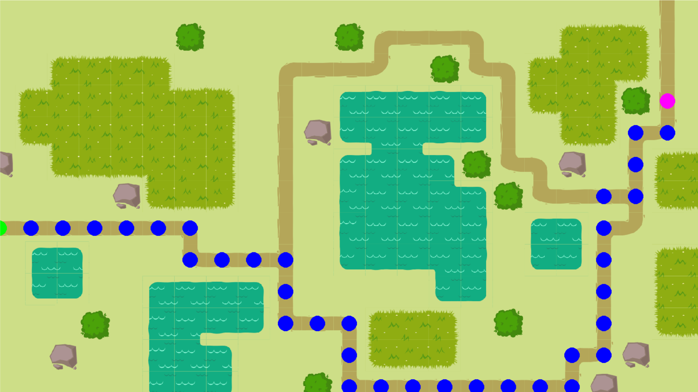
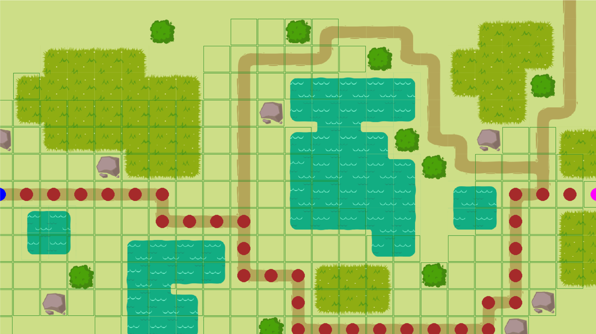
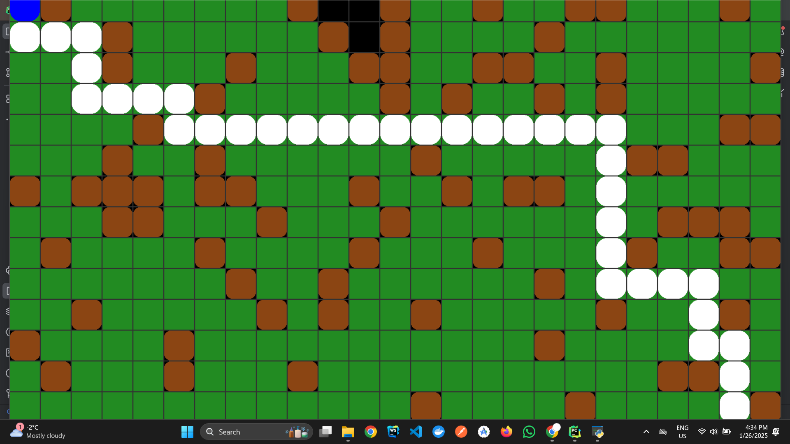
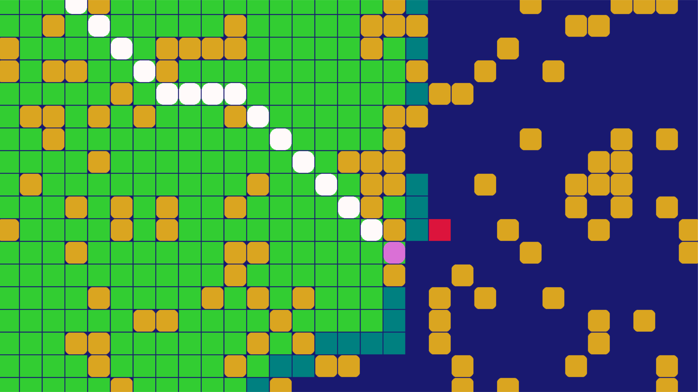
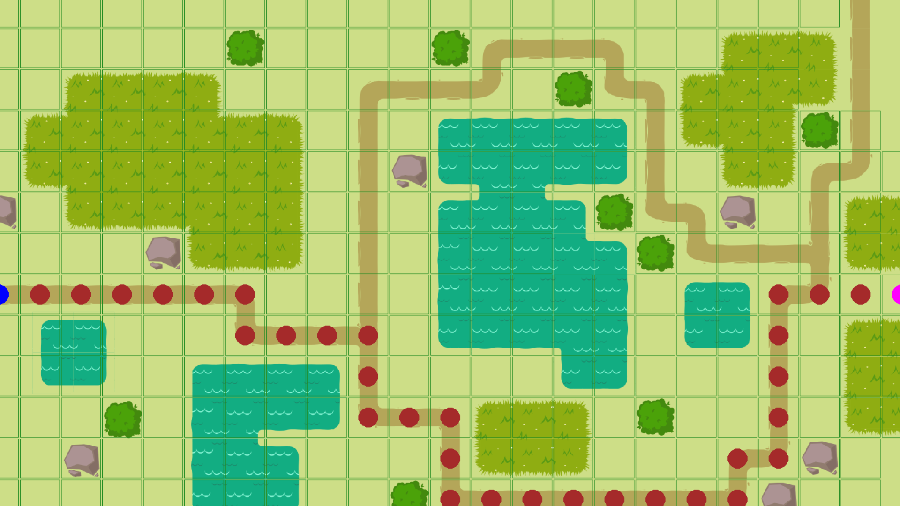

# Pathfinding Algorithms Visualizer

This project is a Pygame-based visualization tool for three popular pathfinding algorithms: **A\* (A-star)**, **Breadth-First Search (BFS)**, and **Dijkstra's Algorithm**. It allows users to interactively create grids, set start and goal positions, and visualize how each algorithm finds the shortest path.

## 🛠️ Tools Used

- **Python**  
    
  *Python is a powerful programming language used for this project.*

- **NumPy**  
    
  *NumPy is used for efficient numerical computations.*

- **PyCharm**  
    
  *PyCharm is the IDE used for Python development.*

## Features

- **Interactive Grid**:
  - Left-click to place walls
  - Right-click to set the start and goal positions

- **Visualization**:
  - Explored nodes are shown in real-time
  - The shortest path is highlighted

## Screenshots
## A\* Controlled Algorithm


## A\* Algorithm 


## Breadth-First Search (BFS)

## Breadth-First Search Controlled (BFS)


## Dijkstra's Algorithm



## Requirements

- Python 3.x
- Pygame library

## Installation

1. Clone the repository:
   ```bash
   git clone https://github.com/Deeppatel91/Python-Dijkstra-BFS-A-star.git
   ```

## Algorithms Overview
### A* Algorithm
A* is a heuristic-based algorithm that combines the cost to reach a node and an estimated cost to the goal. It is highly efficient and guarantees the shortest path if the heuristic is admissible.

## Breadth-First Search (BFS)
 BFS explores all nodes at the current depth level before moving to the next level. It guarantees the shortest path in unweighted graphs.

## Dijkstra's Algorithm
 Dijkstra's algorithm finds the shortest path in weighted graphs by prioritizing nodes with the lowest cost. Unlike A*, it does not use a heuristic but ensures optimality in weighted scenarios.


## Contributing

Contributions are welcome! Please open an issue or submit a pull request for any improvements or bug fixes.


Enjoy visualizing pathfinding algorithms! 🚀